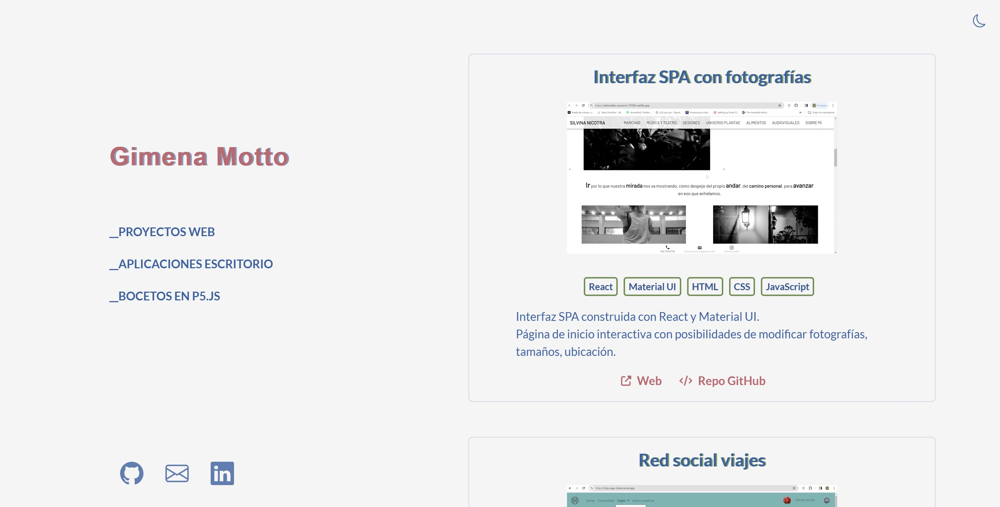
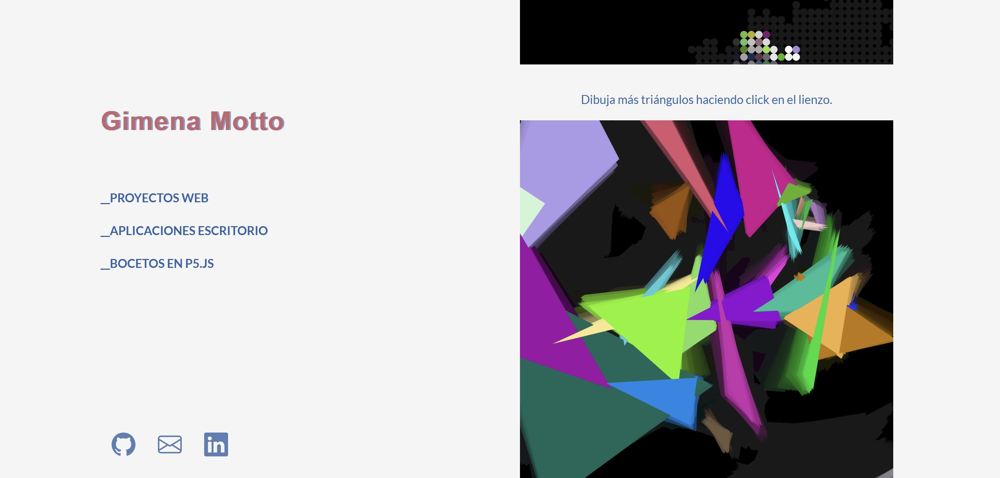

# 🚀 My Portfolio

Welcome to my portfolio! You can visit the deployed version [here](https://portfolio-pim.vercel.app/).

## Technologies Used

- **React**
- **Bootstrap**
- **HTML**
- **CSS**
- **JavaScript**
- **Node.js**

## 🛠️ Projects

Here are some of the projects I've worked on:

1. **Single Page Interface with Photos**
   - **Description:** Single Page Interface built with React and Material UI. Interactive homepage with options to modify photographs, sizes, and location.
   - **Technologies Used:** React, Material UI, HTML, CSS, JavaScript.
   - **Demo:** [View demo](https://admirable-cascaron-37509c.netlify.app/)
   - **GitHub Repository:** [GitHub Repo](https://github.com/GimenaMotto/SilvinaNicotra)

2. **Travel Social Network**
   - **Description:** Full-stack application using the MERN stack. React-based SPA consisting of multiple views and implementing all CRUD actions. Backend API created with ExpressJS, MongoDB, and Mongoose. Registration, login, logout, and authorization functions. Backend validation and error handling. Google Maps integration. Developed with Alvaro Moreno.
   - **Technologies Used:** MongoDB, ExpressJS, ReactJS, NodeJS, HTML, CSS, JavaScript, Bootstrap.
   - **Demo:** [View demo](https://trips-app-client.vercel.app/)
   - **GitHub Repository (Client):** [GitHub Repo](https://github.com/ivanpereariza/backend-project)
   - **GitHub Repository (Server):** [GitHub Repo](https://github.com/ivanpereariza/backend-project)

3. **Wiki Rick and Morty**
   - **Description:** Social network with registration, login, logout, and authorization functions. CRUD application. Google Maps integration. Backend validation and error handling. We worked with the following API: https://rickandmortyapi.com/. Developed with Iván Pereiro.
   - **Technologies Used:** HTML, CSS, JavaScript, MongoDB, Mongoose, ExpressJS, Nodemailer, Cloudinary, Google API.
   - **Demo:** [View demo](https://rick-and-morty-project.fly.dev/)
   - **GitHub Repository:** [GitHub Repo](https://github.com/ivanpereariza/backend-project)

4. **Billing App**
   - **Description:** Application for the accounting area of Oposiciones Arquitectos Madrid. Generates invoices in PDF format with student data and sends them to their email addresses via Nodemailer.
   - **Technologies Used:** ElectronJS, NodeJS, HTML, CSS, JavaScript, Nodemailer, JSON.
   - **GitHub Repository:** [GitHub Repo](https://github.com/OposicionesArquitectoMadrid/interfaz)

   Check out my portfolio for more projects!

## How to Run Locally

If you want to run this project locally, follow these steps:

1. Clone this repository.
2. Navigate to the project directory.
3. Install dependencies by running `npm install`.
4. Start the development server by running `npm start`.
5. Open your web browser and go to `http://localhost:3000` to view the project.

## 📞 Contact

Feel free to reach out to me if you have any questions or suggestions. You can find my contact information on my portfolio website.

Thank you for visiting! 🙌
